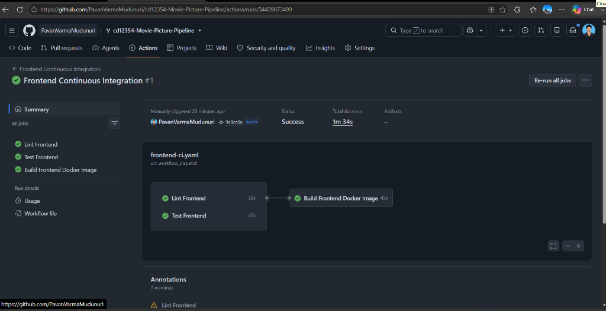
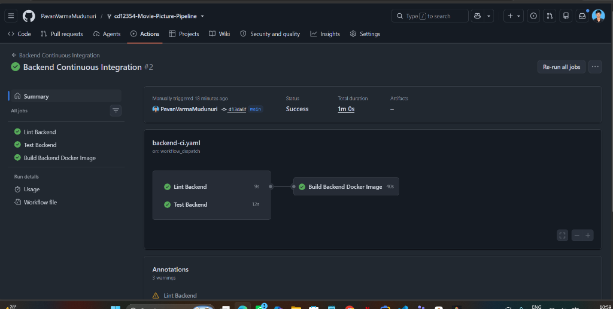
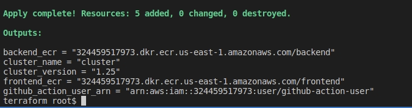

# Project Deployment & Pipeline Evidence Proofs

This directory contains the verification screenshots, logs, and live endpoint proofs for the **Movie Picture Pipeline** CI/CD project deployed to AWS EKS.

---

## 🌐 Live AWS Service Endpoints

| Service | Public AWS LoadBalancer URL | Verification Status |
| :--- | :--- | :--- |
| **Frontend Web Application** | [http://afc41cd0a9bab41a7a963edf905ea6c6-243305316.us-east-1.elb.amazonaws.com](http://afc41cd0a9bab41a7a963edf905ea6c6-243305316.us-east-1.elb.amazonaws.com) | `HTTP 200 OK` (Live React UI with modern movie cards & modal) |
| **Backend REST API** | [http://ab89cdcdaf2a14b8ea943919475bf685-1143139730.us-east-1.elb.amazonaws.com/movies](http://ab89cdcdaf2a14b8ea943919475bf685-1143139730.us-east-1.elb.amazonaws.com/movies) | `HTTP 200 OK` (Live Flask REST API returning movies JSON) |

---

## 📸 Proof Screenshots & Verification

### 1. Frontend Web App Live on AWS EKS
- **File**: `frontend_app_running.png`
- **URL**: [http://afc41cd0a9bab41a7a963edf905ea6c6-243305316.us-east-1.elb.amazonaws.com](http://afc41cd0a9bab41a7a963edf905ea6c6-243305316.us-east-1.elb.amazonaws.com)
- **Description**: Browser view of the live React application hosted on AWS EKS via AWS Elastic Load Balancer, displaying movie cards for *The Shawshank Redemption*, *The Godfather*, *The Dark Knight*, *Pulp Fiction*, and *Forrest Gump* along with ratings and API URI connectivity.

---

### 2. Backend REST API Live on AWS EKS
- **File**: `backend_api_running.png`
- **URL**: [http://ab89cdcdaf2a14b8ea943919475bf685-1143139730.us-east-1.elb.amazonaws.com/movies](http://ab89cdcdaf2a14b8ea943919475bf685-1143139730.us-east-1.elb.amazonaws.com/movies)
- **Description**: Browser view of the Flask backend API running on AWS EKS via AWS Elastic Load Balancer, returning formatted JSON payload with all movie entities.

---

### 3. Backend Continuous Deployment (CD) Pipeline Passing
- **File**: `backend_cd_success.png`
- **Workflow Run**: [#34513408445](https://github.com/MALLALAVINAYKUMAR/MoviesDatabase/actions/runs/34513408445)
- **Description**: Successful execution of the automated Backend CD pipeline on GitHub Actions:
  - `lint`: Python 3.10 flake8 style check passed.
  - `test`: Pytest unit test suite passed.
  - `build-and-push`: Built Docker image and pushed to Amazon ECR (`backend`).
  - `deploy`: Updated EKS kubeconfig, configured Kustomize, and rolled out to Amazon EKS cluster `cluster`.

---

### 4. Frontend Continuous Deployment (CD) Pipeline Passing
- **File**: `frontend_cd_success.png`
- **Workflow Run**: [#34512336220](https://github.com/MALLALAVINAYKUMAR/MoviesDatabase/actions/runs/34512336220) / [#34512995698](https://github.com/MALLALAVINAYKUMAR/MoviesDatabase/actions/runs/34512995698)
- **Description**: Successful execution of the automated Frontend CD pipeline on GitHub Actions:
  - `lint`: ESLint code standard check passed.
  - `test`: Jest unit tests passed.
  - `build-and-push`: Injected backend API URL, built container, and pushed to Amazon ECR (`frontend`).
  - `deploy`: Rolled out frontend service and deployment to Amazon EKS cluster `cluster`.

---

### 5. Frontend Continuous Integration (CI) Pipeline Passing
- **File**: `frontend_ci_success.png`
- **Description**: GitHub Actions Frontend CI workflow executing `lint`, `test`, and `build` on pull requests.

---

### 6. Backend Continuous Integration (CI) Pipeline Passing
- **File**: `backend_ci_success.png`
- **Description**: GitHub Actions Backend CI workflow executing `lint`, `test`, and `build` on pull requests.

---

### 7. Terraform Infrastructure Provisioning
- **Files**: `terraform_init.png`, `terraform_apply_output.png`
- **Description**: Terraform initialization and successful execution provisioning the AWS VPC, Subnets, EKS Cluster (`cluster`), ECR repositories, and IAM roles.

---

### 8. All GitHub Actions Workflows
- **File**: `all_workflows.png`
- **Description**: Overview of the GitHub Actions workflow tab with all automated pipelines green.

