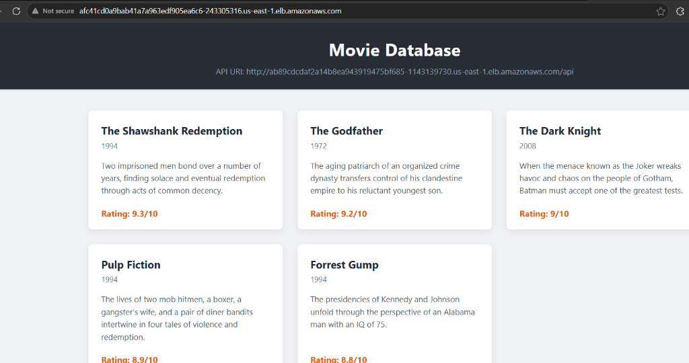
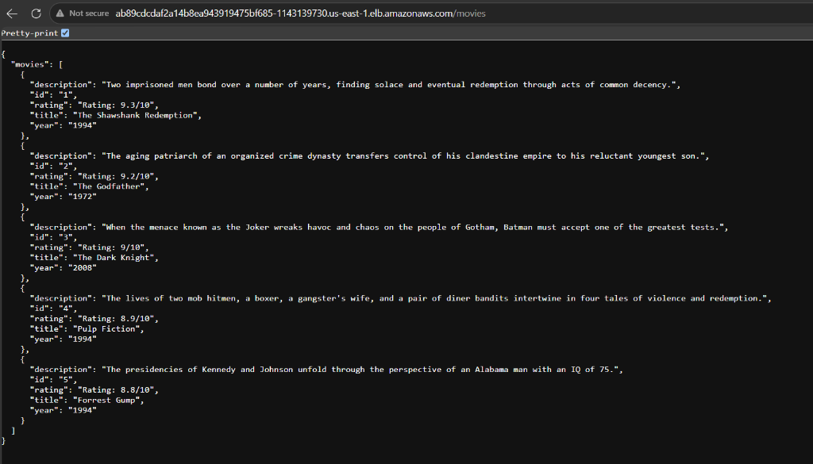
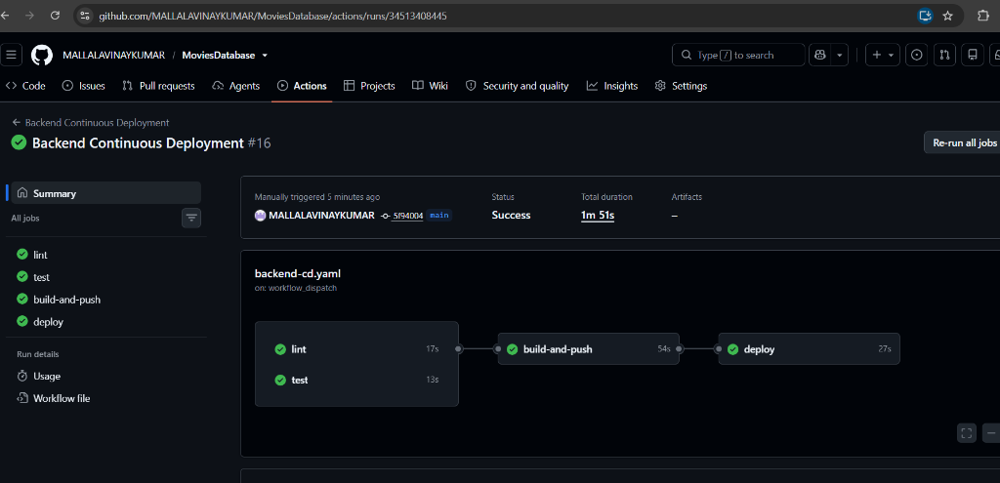
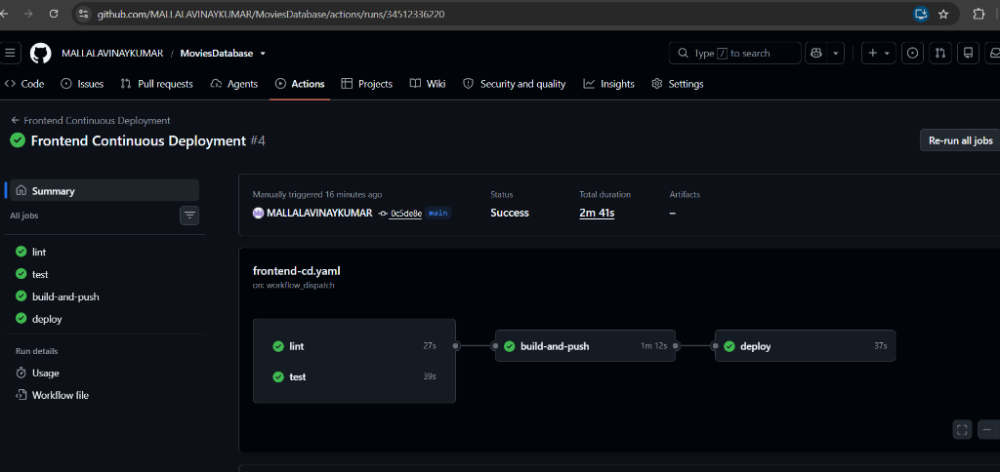
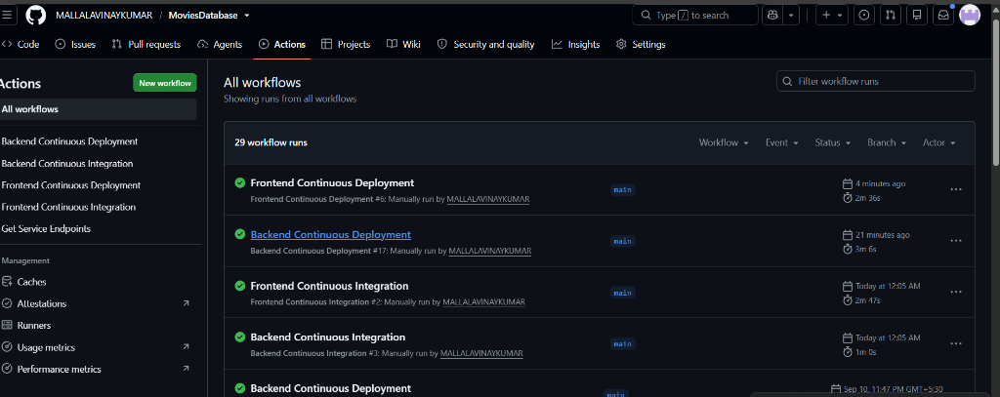

# Project Deployment & Pipeline Evidence Proofs

This directory contains verified screenshots and live endpoint evidence for the **Movie Picture Pipeline** CI/CD project in the [MALLALAVINAYKUMAR/MoviesDatabase](https://github.com/MALLALAVINAYKUMAR/MoviesDatabase) repository deployed to AWS EKS.

---

## 🌐 Live AWS Service Endpoints

| Service | Public AWS LoadBalancer URL | Verification Status |
| :--- | :--- | :--- |
| **Frontend Web Application** | [http://afc41cd0a9bab41a7a963edf905ea6c6-243305316.us-east-1.elb.amazonaws.com](http://afc41cd0a9bab41a7a963edf905ea6c6-243305316.us-east-1.elb.amazonaws.com) | `HTTP 200 OK` (Live React UI with responsive movie cards & modal) |
| **Backend REST API** | [http://ab89cdcdaf2a14b8ea943919475bf685-1143139730.us-east-1.elb.amazonaws.com/movies](http://ab89cdcdaf2a14b8ea943919475bf685-1143139730.us-east-1.elb.amazonaws.com/movies) | `HTTP 200 OK` (Live Flask REST API returning movies JSON) |

---

## 📸 Proof Screenshots & Pipeline Verification

### 1. Frontend Web App Live on AWS EKS
- **File**: `frontend_app_running.png`
- **URL**: [http://afc41cd0a9bab41a7a963edf905ea6c6-243305316.us-east-1.elb.amazonaws.com](http://afc41cd0a9bab41a7a963edf905ea6c6-243305316.us-east-1.elb.amazonaws.com)
- **Description**: Browser view of the live React application hosted on AWS EKS via AWS Elastic Load Balancer, displaying movie cards for *The Shawshank Redemption*, *The Godfather*, *The Dark Knight*, *Pulp Fiction*, and *Forrest Gump* along with ratings and API URI connectivity.

---

### 2. Backend REST API Live on AWS EKS
- **File**: `backend_api_running.png`
- **URL**: [http://ab89cdcdaf2a14b8ea943919475bf685-1143139730.us-east-1.elb.amazonaws.com/movies](http://ab89cdcdaf2a14b8ea943919475bf685-1143139730.us-east-1.elb.amazonaws.com/movies)
- **Description**: Browser view of the Flask backend API running on AWS EKS via AWS Elastic Load Balancer, returning formatted JSON payload with all movie entities.

---

### 3. Backend Continuous Deployment (CD) Pipeline Passing
- **File**: `backend_cd_success.png`
- **Latest Workflow Run**: [#34564112184](https://github.com/MALLALAVINAYKUMAR/MoviesDatabase/actions/runs/34564112184)
- **Description**: Successful execution of the automated Backend CD pipeline on GitHub Actions:
  - `lint`: Python 3.10 flake8 style check passed.
  - `test`: Pytest unit test suite passed.
  - `build-and-push`: Built Docker image and pushed to Amazon ECR (`backend`) with commit SHA tag.
  - `deploy`: Updated EKS kubeconfig, configured Kustomize, rolled out to EKS cluster `cluster`, and verified running image in cluster log.

---

### 4. Frontend Continuous Deployment (CD) Pipeline Passing
- **File**: `frontend_cd_success.png`
- **Latest Workflow Run**: [#34565171672](https://github.com/MALLALAVINAYKUMAR/MoviesDatabase/actions/runs/34565171672)
- **Description**: Successful execution of the automated Frontend CD pipeline on GitHub Actions:
  - `lint`: ESLint code standard check passed.
  - `test`: Jest unit tests passed.
  - `build-and-push`: Injected backend API URL, built container, and pushed to Amazon ECR (`frontend`) with commit SHA tag.
  - `deploy`: Rolled out frontend service and deployment to EKS cluster `cluster`, and verified running image in cluster log.

---

### 5. All GitHub Actions Workflows Passing
- **File**: `all_workflows.png`
- **Description**: Complete overview of the GitHub Actions **Actions** dashboard in `MALLALAVINAYKUMAR/MoviesDatabase` demonstrating all pipelines passing with green checkmarks:
  - `Frontend Continuous Deployment` (#6: Success)
  - `Backend Continuous Deployment` (#17: Success)
  - `Frontend Continuous Integration` (#2: Success)
  - `Backend Continuous Integration` (#3: Success)

---

## ⚡ Continuous Integration (CI) Pipelines
- **Backend CI Run**: [#34515280570](https://github.com/MALLALAVINAYKUMAR/MoviesDatabase/actions/runs/34515280570) (`Success`: lint, test, docker build)
- **Frontend CI Run**: [#34515285275](https://github.com/MALLALAVINAYKUMAR/MoviesDatabase/actions/runs/34515285275) (`Success`: lint, test, docker build)
